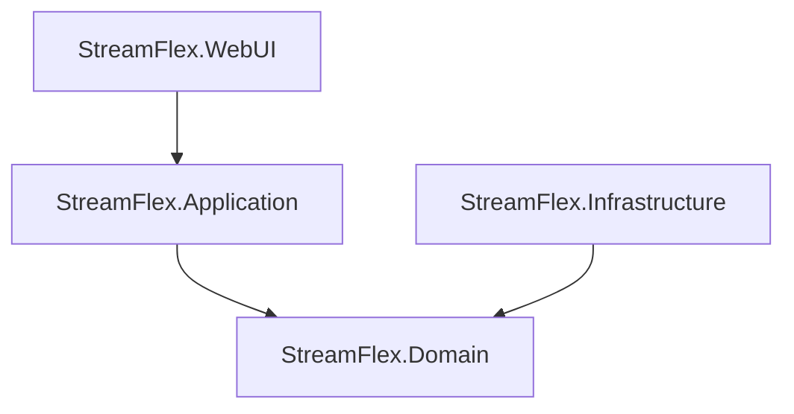

[development](md/development/development.md)


Для реализации этого сценария нам потребуется выполнить следующие шаги:

1. Получение ссылки от пользователя: На этом этапе пользователь предоставляет ссылку на видео, которое он хочет загрузить. Это может быть реализовано через веб-интерфейс или API.

2. Проверка ссылки: Проверьте, является ли предоставленная ссылка действительной и доступной для загрузки. Это может включать проверку формата URL и доступности ресурса.

3. Загрузка видео: Используйте библиотеку или инструмент для загрузки видео по ссылке. Важно убедиться, что ваше приложение может обрабатывать потенциально большие файлы и различные форматы видео.

4. Сохранение видео: После загрузки видео сохраните его в вашей системе файлов или облачном хранилище. Убедитесь, что у вас есть достаточно места для хранения и что вы следуете всем необходимым правилам безопасности и конфиденциальности.

5. Обновление состояния загрузки: Обновите состояние загрузки в пользовательском интерфейсе или базе данных, чтобы пользователь мог видеть прогресс загрузки.

Вот пример кода на C# для загрузки файла по URL с использованием HttpClient:

---

Разработку проекта можно начать, следуя следующим шагам:

1. Понимание требований и планирование: Первым шагом всегда является понимание требований к проекту и его целей. Это включает в себя обсуждение и документирование функциональных и нефункциональных требований, определение основных функций и возможностей, которые должны быть реализованы, и планирование этапов разработки.

2. Проектирование архитектуры: На основе требований вы должны спроектировать архитектуру вашего приложения. Это включает в себя выбор технологий и инструментов, проектирование структуры базы данных, определение структуры проекта и т.д.

3. Настройка среды разработки: Установите и настройте все необходимые инструменты и технологии, которые вы планируете использовать в проекте. Это может включать в себя настройку IDE, установку пакетов и библиотек, настройку сервера баз данных и т.д.

4. Разработка основных функций: Начните с разработки основных функций вашего приложения. Обычно это начинается с создания базовой структуры проекта и реализации ключевых функций.

5. Тестирование: После того, как основные функции будут реализованы, вы должны провести тестирование, чтобы убедиться, что все работает правильно. Это может включать в себя модульное тестирование, интеграционное тестирование, тестирование производительности и т.д.

6. Итерация: Разработка программного обеспечения - это итеративный процесс. После того, как вы реализуете и протестируете основные функции, вы можете перейти к следующему набору функций и повторить процесс.

7. Деплой: После того, как все функции были реализованы и протестированы, вы можете развернуть свое приложение.

8. Поддержка и обновление: После развертывания приложения важно продолжать поддерживать и обновлять его, исправлять ошибки, добавлять новые функции и т.д.

Помните, что этот процесс может варьироваться в зависимости от требований проекта, выбранных методологий (например, Agile, Waterfall и т.д.) и других факторов.


с компонентами разобрались, но тут лучше отделить:
1. проекты, а проекты положить в отдельные папки (проект, может быть отдельным docker image)
   - создать диаграмму проектов и их взаимодейтсвие
      - 
```
sequenceDiagram
Alice->>John: Hello John, how are you?
loop Healthcheck
    John->>John: Fight against hypochondria
end
Note right of John: Rational thoughts!
John-->>Alice: Great!
John->>Bob: How about you?
Bob-->>John: Jolly good!
```
    - описать предназначение каждого проекта
    - StreamFlex.WebUI (Blazor приложение): Пользователь вводит ссылку на видео в пользовательский интерфейс. Это приложение затем передает эту ссылку в StreamFlex.Application.
    - StreamFlex.Application: Этот проект будет содержать основную бизнес-логику вашего приложения. Он получает ссылку на видео от StreamFlex.WebUI и передает ее в StreamFlex.Infrastructure для обработки.
    - StreamFlex.Infrastructure: Этот проект будет взаимодействовать с внешними API (в данном случае, YouTube API) для загрузки видео. Он также будет отвечать за преобразование видео в нужный формат и сохранение его в файловой системе.
    - StreamFlex.MediaStorage (отдельный Docker образ): Этот образ будет отвечать за хранение и управление медиафайлами. Он получит обработанный видеофайл от StreamFlex.Infrastructure и сохранит его в подходящем месте.


1. определить для каждого проекта структуру

The project follows the Domain-Driven Design (DDD) methodology and is divided into the following main components:
- **StreamFlex.Domain**: Contains the core business rules and logic of the application, including entities, aggregates, value objects, and other domain model elements.
- **StreamFlex.Infrastructure**: Responsible for interactions with external resources such as the database, file system, and external APIs (in this case, the YouTube API).
- **StreamFlex.Application**: Contains the application logic that coordinates the interaction between the domain and infrastructure. It includes application services, DTOs, repository interfaces, etc.
- **StreamFlex.WebUI**: Responsible for the presentation and user interface of the application, using Blazor for the web interface.
- **StreamFlex.Tests**: Contains all tests for the application, including unit tests, integration tests, etc.


