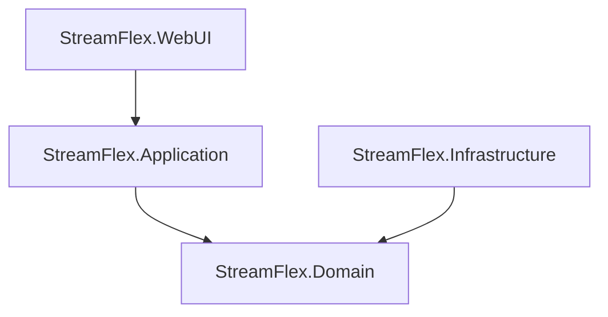


с компонентами разобрались, но тут лучше отделить:
1. проекты, а проекты положить в отдельные папки (проект, может быть отдельным docker image)
   - создать диаграмму проектов и их взаимодейтсвие
      - 
```
sequenceDiagram
Alice->>John: Hello John, how are you?
loop Healthcheck
    John->>John: Fight against hypochondria
end
Note right of John: Rational thoughts!
John-->>Alice: Great!
John->>Bob: How about you?
Bob-->>John: Jolly good!
```
    - описать предназначение каждого проекта
    - StreamFlex.WebUI (Blazor приложение): Пользователь вводит ссылку на видео в пользовательский интерфейс. Это приложение затем передает эту ссылку в StreamFlex.Application.
    - StreamFlex.Application: Этот проект будет содержать основную бизнес-логику вашего приложения. Он получает ссылку на видео от StreamFlex.WebUI и передает ее в StreamFlex.Infrastructure для обработки.
    - StreamFlex.Infrastructure: Этот проект будет взаимодействовать с внешними API (в данном случае, YouTube API) для загрузки видео. Он также будет отвечать за преобразование видео в нужный формат и сохранение его в файловой системе.
    - StreamFlex.MediaStorage (отдельный Docker образ): Этот образ будет отвечать за хранение и управление медиафайлами. Он получит обработанный видеофайл от StreamFlex.Infrastructure и сохранит его в подходящем месте.


1. определить для каждого проекта структуру

The project follows the Domain-Driven Design (DDD) methodology and is divided into the following main components:
- **StreamFlex.Domain**: Contains the core business rules and logic of the application, including entities, aggregates, value objects, and other domain model elements.
- **StreamFlex.Infrastructure**: Responsible for interactions with external resources such as the database, file system, and external APIs (in this case, the YouTube API).
- **StreamFlex.Application**: Contains the application logic that coordinates the interaction between the domain and infrastructure. It includes application services, DTOs, repository interfaces, etc.
- **StreamFlex.WebUI**: Responsible for the presentation and user interface of the application, using Blazor for the web interface.
- **StreamFlex.Tests**: Contains all tests for the application, including unit tests, integration tests, etc.


