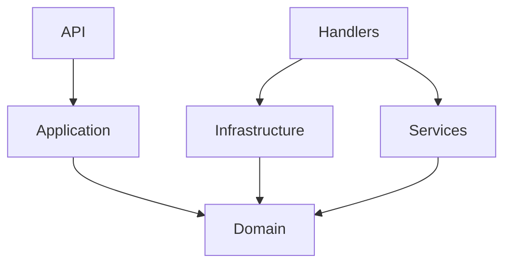

# Development of Download Worker

[Go back](../development.md#development-of-download-worker)

- [Development of Download Worker](#development-of-download-worker)
  - [Description](#description)
- [Download Worker Project Structure](#download-worker-project-structure)
  - [Domain-Driven Design (DDD) Principles](#domain-driven-design-ddd-principles)
  - [Modern Development Principles](#modern-development-principles)
  - [DownloadWorker Architecture Components](#downloadworker-architecture-components)
  - [Conclusion](#conclusion)
  - [Current task](#current-task)
  - [TimeLine](#timeline)

## Description
The development of the DownloadWorker architecture as part of the comprehensive StreamFlex system, which includes a Blazor web server, MySQL database, Redis cache, RabbitMQ message queue server, reverse proxy, static file server, other workers, and logging, requires focusing on several key aspects:


# Download Worker Project Structure
[Download Worker Project Structure page](download-worker-project-structure/download-worker-project-structure.md)



## Domain-Driven Design (DDD) Principles
- **Bounded Context Definition**: DownloadWorker has a clearly defined area of responsibility, which includes downloading video files and interacting with users.
- **Domain Objects (Entities and Value Objects)**: Identify key domain elements such as VideoFile, UserRequest, etc., which will be used within DownloadWorker.
- **Domain Services**: Define services that perform specific tasks such as handling download requests and managing data flow.

## Modern Development Principles
- **Clean Architecture**: Develop DownloadWorker so that logic is separated from external dependencies. This ensures code flexibility and testability.
- **Asynchrony and Concurrency**: Since DownloadWorker will be performing file downloads, it's important to implement asynchronous operations and manage concurrent access to resources.
- **Integration with Message Queue (RabbitMQ)**: DownloadWorker should be able to effectively communicate with RabbitMQ for handling tasks that should not block the main application thread.

## DownloadWorker Architecture Components
- **Video Downloading**: The central part of DownloadWorker, which is responsible for receiving and storing video files.
- **Database Interaction**: DownloadWorker requires a mechanism for interacting with the database to store video metadata and download status information.
- **Logging**: Integration with the logging system for tracking actions and possible errors.
- **Configuration and Management**: Setting up DownloadWorker operation parameters such as file storage paths, download speed limits, etc.

## Conclusion
- **Testing**: Thorough testing of DownloadWorker to ensure its reliability and efficiency.
- **Documentation**: Creating clear documentation for DownloadWorker, including its functions, settings, and usage instructions.

## Current task

- [ ] Development DownloadWorker Classes Architecture (16:20-18:31)
  - [ ] Learning the How MessageBus works (18:36-)
  - [x] Distribution of classes between projects (18:31)
  - [x] Learning the principles of DDD (18:31)


## TimeLine

2023/12/10
- [x] Development DownloadWorker Project Architecture (12:30-16:20)
  - [x] Project structure (15:00)
    - [x] Create the project structure (16:20)
  - [x] documentation (14:20)
    - [x] File structure
```bash
@echo off

SET namespace=StreamFlex.DownloadWorker.
SET solutionPath=D:\termit\StreamFlex\src\StreamFlex.sln

REM Create projects
dotnet new classlib -n %namespace%Core -o %namespace%Core
dotnet new classlib -n %namespace%Services -o %namespace%Services
dotnet new classlib -n %namespace%Infrastructure -o %namespace%Infrastructure
dotnet new webapi -n %namespace%Api -o %namespace%Api
dotnet new classlib -n %namespace%Application -o %namespace%Application
dotnet new xunit -n %namespace%Tests -o %namespace%Tests

REM Add projects to the existing solution
dotnet sln %solutionPath% add %namespace%Core/%namespace%Core.csproj
dotnet sln %solutionPath% add %namespace%Services/%namespace%Services.csproj
dotnet sln %solutionPath% add %namespace%Infrastructure/%namespace%Infrastructure.csproj
dotnet sln %solutionPath% add %namespace%Api/%namespace%Api.csproj
dotnet sln %solutionPath% add %namespace%Application/%namespace%Application.csproj
dotnet sln %solutionPath% add %namespace%Tests/%namespace%Tests.csproj

REM Add project references
dotnet add %namespace%Services/%namespace%Services.csproj reference %namespace%Core/%namespace%Core.csproj
dotnet add %namespace%Infrastructure/%namespace%Infrastructure.csproj reference %namespace%Core/%namespace%Core.csproj
dotnet add %namespace%Api/%namespace%Api.csproj reference %namespace%Services/%namespace%Services.csproj
dotnet add %namespace%Application/%namespace%Application.csproj reference %namespace%Services/%namespace%Services.csproj
dotnet add %namespace%Tests/%namespace%Tests.csproj reference %namespace%Core/%namespace%Core.csproj
dotnet add %namespace%Tests/%namespace%Tests.csproj reference %namespace%Services/%namespace%Services.csproj
dotnet add %namespace%Tests/%namespace%Tests.csproj reference %namespace%Infrastructure/%namespace%Infrastructure.csproj

echo Project setup completed.
```
---
Next steps include creating a Dockerfile for the worker service and deploying it on the server.
- [x] Deploy and run the worker service on the server.
  - [x] Launch on Portainer (12:30)
    - [x] Fix issue with container operation
  - [x] Fixed the Dockerfile (10:19 - 11:11)
    - [x] Checking Dockerfile corrections (11:11)

```bash
docker build -t streamflex-download-worker .
```
---
- [x] Create a Dockerfile for the worker service.
- [x] Initialized the Download Worker service project using the command:
```bash
dotnet new worker -n StreamFlex.DownloadWorker
```